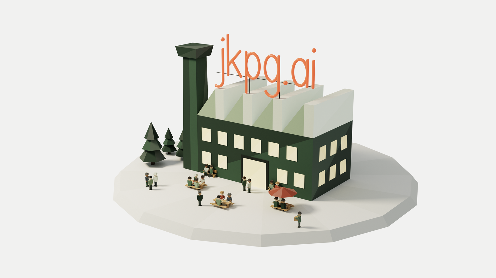

<picture>
  <source media="(prefers-color-scheme: dark)" srcset="./banner.lunch.dark.png">
  
</picture>

# jkpg.ai

**Applied AI-community i Jönköpings-regionen.**

Du hör hemma här om du bygger med AI, experimenterar eller är nyfiken. Tänkare och skapare i Jönköping träffas snart. Anmäl dig, så är du med.

- Webbplats: [jkpg.ai](https://jkpg.ai)
- Styrning, beslut och konventioner: [jkpg-ai/foundation](https://github.com/jkpg-ai/foundation)

---

**Applied AI community in the Jönköping region.**

You belong here if you build with AI, experiment or are simply curious. Thinkers and builders in Jönköping are meeting soon. Sign up, and you are in.

- Website: [jkpg.ai](https://jkpg.ai)
- Governance, decisions and conventions: [jkpg-ai/foundation](https://github.com/jkpg-ai/foundation)
